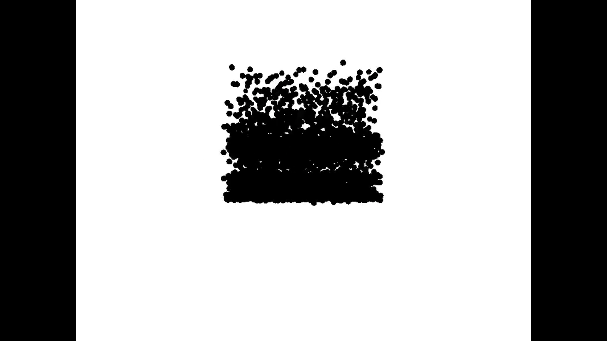
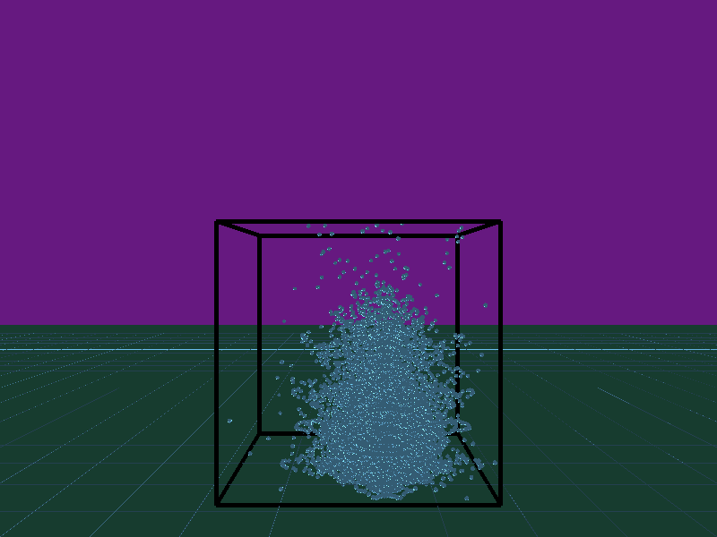

# SPH Computer Graphics

## Introduction

Computing fluid dynamics is a difficult problem as the physics involved are very computationally expensive. However, in many computer graphics applications, it is sufficient to use an approximation of the dynamics of the fluids for rendering purposes. One such method used in several areas is called the Smoothed Particle Hydrodynamics (SPH) method. In this method, the forces acting on a particle are "smoothed" using a kernal fucntion that approximates the forces on the particle in relation to its neighbours.

This method is extensively used in animation and can also be used to simulate cloth movements.

## Implementation

In this project, we have modified the SPH algorithm for implementation in a discretised case. The particles in this case are assumed to be spherical in shape and obey all the laws of classical mechanics. The particles are initally suspended in mid-air and then they fall with gravity to rebound with the surface. The orientation ofparticles in the beginning can be changed to a spherical shape by setting ```SPHERE_MODE``` to ```true```.

Kernels have been used for computing the physcial properties of each particle. In this case, we have used a Gaussian kernel for weighting the effects of the neighbouring particles for the particle under consideration. The coefficients for the kernels have been taken from online reference values.

The project has been programmed using OpenGL's 3.3 programmable pipeline. This gives tremendous flexibility when it comes to defining the process for rendering the scene as the vertex and fragment shaders can be defined by the programmer. In this case, we have implemented a combined lighting system with both ambient and diffuse lighting. The core pipeline also allows all rendering operations to take place on the GPU, offloading the CPU to do the physics calcualtions for the particles. In this case, the gains of using the core pipeline over the fixed function pipeline are in the order of 5-10x.

Furthermore, to improve framerate and to obtain a better picture of the scene, an offscreen rendering method has been used. In this, frames have been rendered to a directory as bitmaps and are then reconstructed to form a short movie of the dynamics of the fluid. These frames are then recombined using ffmpeg as so:

```ffmpeg -i 'img-%03d.bmp' -r 30 out.mkv```

Rendering modes can be changed by changing the value of ```OFFSCREEN``` to ```true``` or ```false``` in ```sphviewer.cpp```.

## Dependencies

Install the dependencies using ```apt```:

```sudo apt install libglfw3 libglew-dev glew-utils libglew2.0 assimp-utils libassimp-dev libassimp3v5 freeglut3-dev libxmu-dev libxi-dev libfreeimage-dev```

## Installation

Copy the files to your favorite directory and then run:

```
mkdir build
cd build
mkdir img
cmake ..
make -j4
./sphviewer
```

## Results

We have made a compilation of videos of the results here: [goo.gl/SDxqKH](goo.gl/SDxqKH)



Initial test when rendering the scene.



Demonstration of the spreading of particles on applying SPH. The core pipeline was added in this part.


Rendering a sphere of particles for the initial collision.